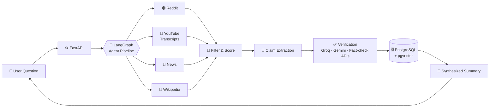

<div align="center">

# 🧵 TrueThread

### Ask anything. Get a cross-verified summary of what the internet actually thinks.

*TrueThread turns a natural-language question into a synthesized, fact-checked summary of public opinion by scraping and analyzing multiple online sources, cutting through scattered, biased, or unverified takes.*

<br>


<br>

[💡 Why](#-why-truethread) •
[✨ Features](#-features) •
[🏗️ Architecture](#️-architecture) •
[⚡ Optimization](#-llm-cost-optimization) •
[🚀 Getting Started](#-getting-started) •
[📁 Structure](#-project-structure)

</div>

---

## 💡 Why TrueThread?

Search for any contested topic and you get a pile of conflicting threads, videos, and headlines. Some are biased, some are outdated, and many are simply unverified. Reading all of it yourself takes hours, and trusting any one of it is risky.

**TrueThread does the legwork:**

1. 🔎 Collects what people are saying across multiple platforms
2. 🧪 Extracts the claims being made and **verifies them against reliable sources**
3. 🧾 Produces one **balanced, trustworthy summary** you can actually use

It is aimed at topics where misinformation spreads fastest: **political news, war coverage, and government welfare schemes**.

---

## 🌐 Sources It Analyzes

| Source | What it contributes |
| :-: | --- |
| 🟠 **Reddit** | Community discussion and ground-level opinion |
| 🔴 **YouTube** | Commentary and explainers via video transcripts |
| 📰 **News** | Reporting from news outlets and wire services |
| 📖 **Wikipedia** | Neutral background and baseline facts |

---

## ✨ Features

| | Feature | Description |
| :-: | --- | --- |
| 💬 | **Natural-language queries** | Ask a question the way you would ask a person |
| 🕸️ | **Multi-source scraping** | Reddit, YouTube, news, and Wikipedia in one pass |
| 🤖 | **Agentic pipeline** | Orchestrated with LangGraph for staged, controllable reasoning |
| 📚 | **RAG + semantic search** | PostgreSQL with pgvector for retrieving relevant evidence |
| ✅ | **Claim verification** | Cross-checks extracted claims against trusted sources and fact-check APIs |
| ⚖️ | **Bias awareness** | NLP-based bias scoring to weigh how sources lean |
| ⚡ | **Cost-optimized LLM usage** | Fewer API calls through filtering, scoring, and batching |
| 🐳 | **One-command setup** | Docker Compose for the full stack |

---

## 🏗️ Architecture



### 🔄 Pipeline Stages

| Stage | What happens |
| :-: | --- |
| **1. Understand** | The question is interpreted and turned into targeted source queries |
| **2. Collect** | Content is gathered from Reddit, YouTube, news, and Wikipedia |
| **3. Filter** | Irrelevant or low-quality items are dropped using deterministic keyword scoring |
| **4. Extract** | Key claims are pulled out and capped to keep processing focused |
| **5. Verify** | Claims are verified in batches against reliable sources |
| **6. Synthesize** | A balanced summary of public opinion is generated, grounded in verified evidence |

---

## ⚡ LLM Cost Optimization

Running every scraped item through an LLM gets expensive fast. TrueThread uses a staged plan to cut API calls without hurting answer quality:

- 🚫 **Removed redundant filter calls**: no LLM call where a rule will do
- 🔑 **Deterministic keyword scoring**: cheap, repeatable relevance filtering
- ✂️ **Claim capping**: verify the most important claims instead of all of them
- 📦 **Batched verification**: many claims checked per call instead of one call per claim

---

## 🛠️ Tech Stack

| Layer | Technology |
| --- | --- |
| **Backend API** | FastAPI (Python) |
| **Agent orchestration** | LangGraph, agentic AI, RAG |
| **LLMs** | Groq API, Gemini API |
| **Database** | PostgreSQL + pgvector (semantic search) |
| **Frontend** | _Add your frontend stack here_ |
| **Infrastructure** | Docker, Docker Compose |
| **CI/CD** | GitHub Actions |

---

## 🚀 Getting Started

### Prerequisites

- [Docker](https://www.docker.com/) and Docker Compose
- API keys for **Groq** and **Gemini**

### Run with Docker

```bash
# 1. Clone the repository
git clone https://github.com/sk200005/TrueThread.git
cd TrueThread

# 2. Add your environment variables (see below)

# 3. Build and start everything
docker-compose up --build
```

### 🔐 Environment Variables

Create a `.env` file in the `BackEnd` folder (adjust names to match your code):

```env
GROQ_API_KEY=your_groq_api_key
GEMINI_API_KEY=your_gemini_api_key
DATABASE_URL=postgresql://user:password@db:5432/truethread
```

> ⚠️ Never commit your `.env` file or API keys to the repository.

### 💻 Run Without Docker

```bash
# Backend
cd BackEnd
pip install -r requirements.txt
uvicorn main:app --reload

# Frontend
cd ../FrontEnd
npm install
npm run dev
```

> 📝 Update the entry point and commands above to match your actual setup.

---

## 🧪 Testing

```bash
cd Test
pytest
```

Tests also run automatically on every push through **GitHub Actions** (see `.github/workflows`).

---

## 📁 Project Structure

```text
TrueThread/
├── 📂 .github/workflows/   # CI pipelines
├── 📂 BackEnd/             # FastAPI app, LangGraph pipeline, scrapers, verification
├── 📂 FrontEnd/            # User interface
├── 📂 Test/                # Test suite
├── 📂 docs/                # Documentation and diagrams
└── 🐳 docker-compose.yml   # Full-stack orchestration
```

---

## 📸 Screenshots

> Add screenshots to the `docs/` folder and update the paths below.

| Ask a Question | Verified Summary |
| :---: | :---: |
|  |  |

---

## 🛣️ Roadmap

- [ ] Multi-source validation with more wire services and fact-check APIs
- [ ] Source credibility and bias dashboard
- [ ] Additional platforms beyond Reddit, YouTube, news, and Wikipedia
- [ ] Multilingual question support
- [ ] Caching to avoid re-verifying known claims

---

## ⚠️ Disclaimer

TrueThread summarizes and cross-checks publicly available content using AI. It reduces noise but is not a substitute for primary sources, and results can be imperfect. Always verify critical information yourself.

---

## 🤝 Contributing

Contributions, issues, and feature requests are welcome. Feel free to open an [issue](https://github.com/sk200005/TrueThread/issues) or submit a pull request.

---

<div align="center">

**Built with ❤️ by [@sk200005](https://github.com/sk200005)**

⭐ If you find TrueThread useful, consider giving it a star!

</div>
